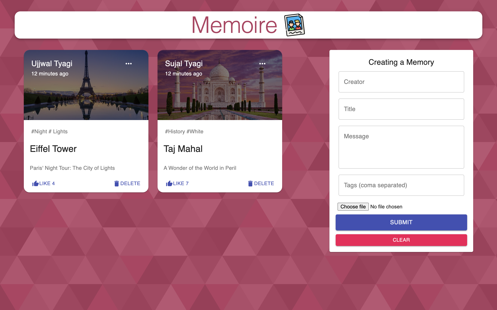

# MEMOIRE - Full Stack MERN Application

This repository contains the code for a  Full Stack MERN (MongoDB, Express, React, Node.js) application called **MEMOIRE**. This application is a simple social media platform where users can share and post memorable events or moments from their lives.


## Screenshot:





## Project Overview
MEMOIRE is a social media application that allows users to:
- Create, edit, and delete posts.
- Upload images and describe their memories.
- View and interact with other user's posts.
- Like on posts.

This application was built using the MERN stack:
- **MongoDB**: Database for storing user information and posts.
- **Express.js**: Backend framework for managing the API and server-side operations.
- **React**: Frontend library for building the user interface.
- **Node.js**: Server environment for handling backend logic and API requests.

## Technologies Used
- **Frontend**:
  - React.js
  - Redux for state management
  - Material-UI for design and UI components
- **Backend**:
  - Node.js
  - Express.js
  - MongoDB with Mongoose for database interactions

### Installation

   ```bash
   git clone https://github.com/ujjwalxtyagi/memoire.git
   cd memoire
   run npm i && npm start for both client and server side to start the app